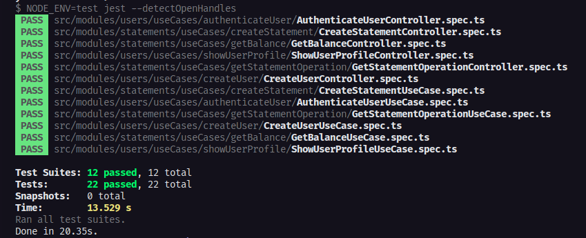

# Testes Unitários e Integração - Ignite

<p align="center">
  
  
  
  
</p>
<br>

<p align="center">
  <a href="#sobre">Sobre</a> •
  <a href="#testes-unitários-e-integração">Testes Unitários e Integração</a> •
  <a href="#instalação">Instalação</a> •
  <a href="#tecnologias">Tecnologias</a> •
  <a href="#autor">Autor</a>  
</p>

<br>

## Sobre

Desafio proposto durante a trilha de NodeJS no bootcamp Ignite da RocketSeat. Esse desafio foi proposto no quarto capitulo da trilha e seu objetivo foi consolidar os conhecimentos ensinados durante o modulo 4 do curso.

## Testes Unitários e Integração

No quarto modulo do bootcamp o assunto foi a escrita de testes unitários e de integração. Fomos desde a contextualização geral dos testes até suas estruturas e boas práticas.

Para realizar os testes utilizamos uma API financeira desenvolvida em módulos anteriores, que contém as seguintes rotas:

<details>
  <summary>POST <code>/api/v1/users</code></summary>
  <br>
  A rota recebe <code>name</code>, <code>email</code> e <code>password</code> dentro do corpo da requisição, salva o usuário criado no banco e retorna uma resposta vazia com status <code>201</code>.
</details>

<details>
  <summary>POST <code>/api/v1/sessions</code></summary>
  <br>
  A rota recebe <code>email</code> e <code>password</code> no corpo da requisição e retorna os dados do usuário autenticado junto à um token JWT.
  <br><br>
  💡 Essa aplicação não possui refresh token, ou seja, o token criado dura apenas 1 dia e deve ser recriado após o período mencionado.
</details>

<details>
  <summary>GET <code>/api/v1/profile</code></summary>
  <br>
  A rota recebe um token JWT pelo header da requisição e retorna as informações do usuário autenticado.
</details>

<details>
  <summary>GET <code>/api/v1/statements/balance</code></summary>
  <br>
  A rota recebe um token JWT pelo header da requisição e retorna uma lista com todas as operações de depósito e saque do usuário autenticado e também o saldo total numa propriedade <code>balance</code>.
</details>

<details>
  <summary>POST <code>/api/v1/statements/deposit</code></summary>
  <br>
  A rota recebe um token JWT pelo header e <code>amount</code> e <code>description</code> no corpo da requisição, registra a operação de depósito do valor e retorna as informações do depósito criado com status <code>201</code>.
</details>

<details>
  <summary>POST <code>/api/v1/statements/withdraw</code></summary>
  <br>
  A rota recebe um token JWT pelo header e <code>amount</code> e <code>description</code> no corpo da requisição, registra a operação de saque do valor (caso o usuário possua saldo válido) e retorna as informações do saque criado com status <code>201</code>.
</details>

<details>
  <summary>GET <code>/api/v1/statements/:statement_id</code></summary>
  <br>
  A rota recebe um token JWT pelo header e o id de uma operação registrada (saque ou depósito) na URL da rota e retorna as informações da operação encontrada.  
</details>

Por fim, deixo abaixo registrado o resultado da execução da bateria de testes implementada para a API:



## Instalação

Antes de começar, você vai precisar ter instalado em sua máquina as seguintes ferramentas:
[Git](https://git-scm.com), [Node.js](https://nodejs.org/en/).
Além disso é bom ter um editor para trabalhar com o código como [VSCode](https://code.visualstudio.com/).

### 🎲 Rodando o Back End

```bash
# Clone este repositório
$ git clone git@github.com:MrRioja/unit-tests-ignite.git

# Acesse a pasta do projeto no terminal/cmd
$ cd unit-tests-ignite

# Instale as dependências
$ npm install
# Caso prefira usar o Yarn execute o comando abaixo
$ yarn

# Execute a aplicação em modo de desenvolvimento
$ npm run dev
# Caso prefira usar o Yarn execute o comando abaixo
$ yarn dev

# Executar os testes
$ npm run test
# Caso prefira usar o Yarn execute o comando abaixo
$ yarn test

# O servidor inciará na porta 3333 ou na porta definida no arquivo .env na variável APP_PORT - acesse <http://localhost:3333>
```

## Tecnologias


<br><br><br>

## Autor

<div align="center">

<h1>Luiz Rioja</h1>
<strong>Backend Developer</strong>
<br/>
<br/>

<a href="https://linkedin.com/in/luizrioja" target="_blank">

</a>

<a href="https://github.com/mrrioja" target="_blank">

</a>

<a href="mailto:lulyrioja@gmail.com?subject=Fala%20Dev" target="_blank">

</a>

<a href="https://api.whatsapp.com/send?phone=5511933572652" target="_blank">

</a>

<a href="https://join.skype.com/invite/tvBbOq03j5Uu" target="_blank">

</a>

<br/>
<br/>
</div>
